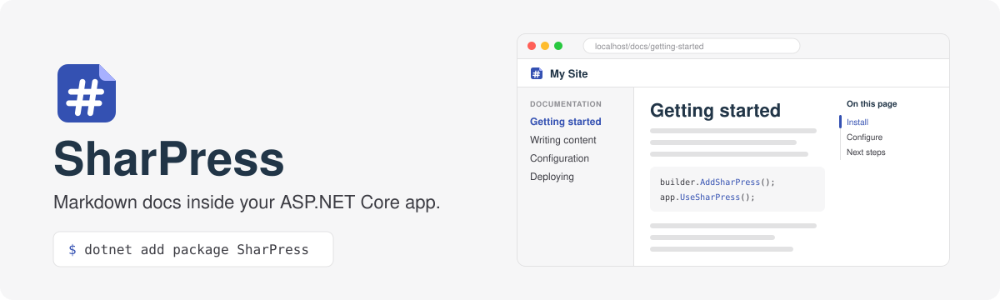

<picture>
  <source media="(prefers-color-scheme: dark)" srcset=".github/assets/banner-dark.svg">
  
</picture>

<p align="center">
  <a href="https://github.com/Viedin/SharPress/actions/workflows/ci.yml"></a>
  <a href="https://www.nuget.org/packages/SharPress"></a>
  <a href="LICENSE"></a>
</p>

Serve a folder of Markdown files as a docs site from your ASP.NET Core app. No Node, no build step: edit a
file, save, refresh.

## Quick start

```
dotnet add package SharPress --prerelease
```

```csharp
using SharPress;

var builder = WebApplication.CreateBuilder(args);
builder.AddSharPress();

var app = builder.Build();
app.UseSharPress();
app.Run();
```

On first run SharPress creates a `SharpLib` folder with a starter site. Open `/` for the home page and
`/docs/getting-started` for the docs.

Options, sign-in and sub-path hosting are covered in the [package README](SharPress/README.md).

## Development

Requires the .NET 10 SDK.

```bash
dotnet build SharPress.slnx
dotnet test SharPress.slnx
dotnet run --project SharPress.Sample
```

## License

[MIT](LICENSE)
